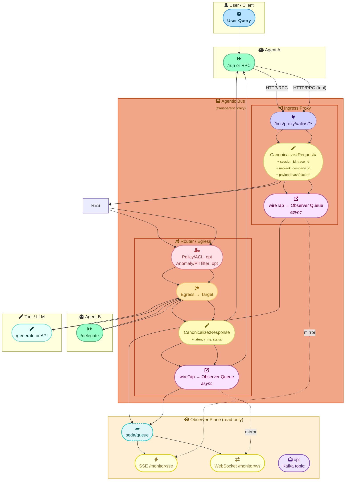

# Observability Architecture

```mermaid
flowchart TD

%% ====================
%% User/Client
subgraph Client["fa:fa-user User / Client"]
  UQ([fa:fa-question-circle<br><b>User Query</b>]):::user
end

%% ====================
%% Agent A
subgraph A["fa:fa-robot Agent A"]
  A1([fa:fa-forward<br>/run or RPC]):::agent
end

%% ====================
%% Agentic Bus (transparent proxy), with Ingress and Router partitions
subgraph BUS["fa:fa-bus Agentic Bus<br><span style='font-size:13px'>(transparent proxy)</span>"]
direction LR

  subgraph Ingress["fa:fa-sign-in-alt Ingress Proxy"]
    IN([fa:fa-plug<br>/bus/proxy/#alias/**]):::ingress
    CAN1([fa:fa-magic<br>Canonicalize#Request#<br><span style='font-size:12px'>+ session_id, trace_id<br>+ network, company_id<br>+ payload hash/excerpt</span>]):::process
    TAP1([fa:fa-external-link-alt<br>wireTap → Observer Queue<br><i>async</i>]):::wiretap
  end

  subgraph Router["fa:fa-random Router / Egress"]
    POL([fa:fa-user-shield<br>Policy/ACL: opt<br>Anomaly/PII filter: opt]):::security
    EG([fa:fa-sign-out-alt<br>Egress → Target]):::egress
    CAN2([fa:fa-magic<br>Canonicalize:Response<br><span style='font-size:12px'>+ latency_ms, status</span>]):::process
    TAP2([fa:fa-external-link-alt<br>wireTap → Observer Queue<br><i>async</i>]):::wiretap
  end
end

%% ====================
%% Observer Plane, Read only
subgraph Observer["fa:fa-eye Observer Plane (read-only)"]
  Q([fa:fa-stream<br>seda/queue]):::observerq
  SSE([fa:fa-bolt<br>SSE /monitor/sse]):::observerterm
  WS([fa:fa-exchange-alt<br>WebSocket /monitor/ws]):::observerterm
  KAFKA([fa:fa-envelope-open:opt<br> Kafka topic:<br><kafka-endpoint>]):::kafka
end

%% ====================
%% Agent B
subgraph B["fa:fa-robot Agent B"]
  B1([fa:fa-forward<br>/delegate]):::agent
end

%% ====================
%% Tool / LLM
subgraph TOOL["fa:fa-magic Tool / LLM"]
  T1([fa:fa-magic<br>/generate or API]):::tool
end

%% ==========
%% Main Process Flows
UQ --> A1
A1 -- HTTP/RPC --> IN
IN --> CAN1 --> TAP1 --> Q
CAN1 --> RES --> POL --> EG --> B1
B1 --> EG --> CAN2 --> TAP2 --> Q --> SSE
Q --> WS
TAP1 -.mirror.-> SSE
TAP2 -.mirror.-> WS
CAN2 --> A1

%% Tool call leg
A1 -- HTTP/RPC (tool) --> IN
IN --> CAN1 --> TAP1
CAN1 --> RES --> POL --> EG --> T1
T1 --> EG --> CAN2 --> TAP2 --> A1

%% =============
%% Class Definitions for color and icons
classDef user      fill:#b7e2ff,color:#133c55,stroke:#3699dd,stroke-width:2px,rounded corners;
classDef agent     fill:#99ffca,color:#145a32,stroke:#50b87e,stroke-width:2px,rounded corners;
classDef ingress   fill:#d1d0ff,color:#2d1267,stroke:#756ac1;
classDef wiretap   fill:#fae3ff,color:#780048,stroke:#af5a97,stroke-width:2px,rounded corners;
classDef process   fill:#fffbbc,color:#635c01,stroke:#d4cc70,stroke-width:2px,rounded corners;
classDef route     fill:#cffffd,color:#134c5d,stroke:#0ad3e6,stroke-width:2px,rounded corners;
classDef security  fill:#ffe0e6,color:#a73439,stroke:#da7a8b,stroke-width:2px,rounded corners;
classDef egress    fill:#ffe6aa,color:#925c00,stroke:#f5cd75,stroke-width:2px,rounded corners;
classDef observerq fill:#e0f7fa,color:#00595c,stroke:#13cfcf,stroke-width:2px,rounded corners,stroke-dasharray: 4 4;
classDef observerterm fill:#ffffe0,color:#8e7329,stroke:#e4d400,stroke-width:2px,rounded corners;
classDef kafka     fill:#efe4fd,color:#552183,stroke:#8c53cc,stroke-width:2px,rounded corners;
classDef tool      fill:#e5fffa,color:#013a36,stroke:#71e1cf,stroke-width:2px,rounded corners;
classDef observer  fill:#ffefd4,color:#6a4900,stroke:#e7c26c,stroke-width:2px,rounded corners;
classDef agentic-bus  fill:#F2A688,color:#6a4900,stroke:#BC4415,stroke-width:2px,rounded corners;
class Observer observer;
class BUS,Ingress,Router agentic-bus;
%% class Ingress ingress;
%% class Router egress;
```

##
