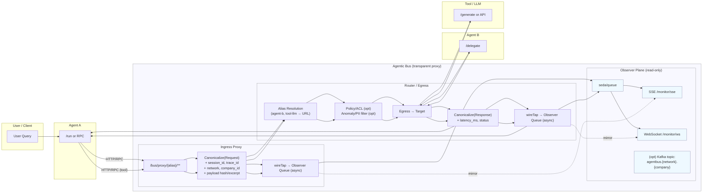
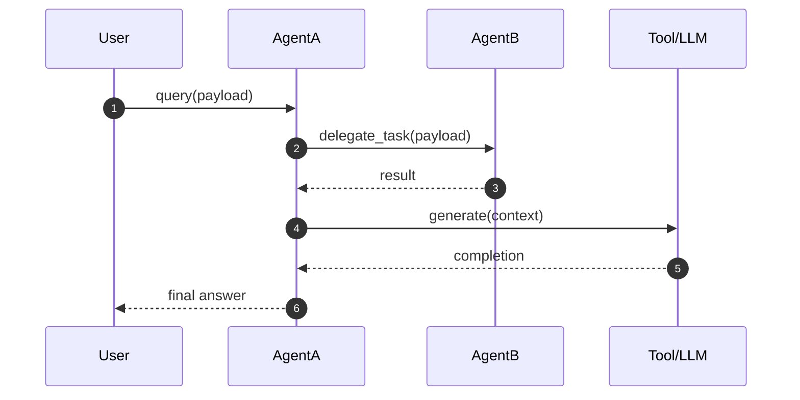
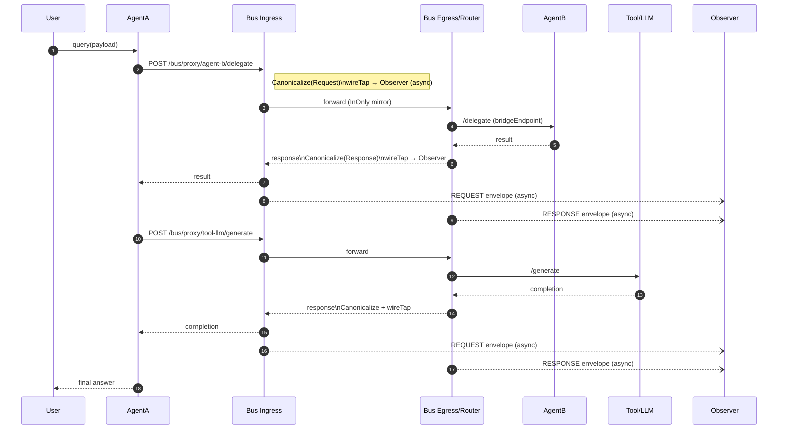
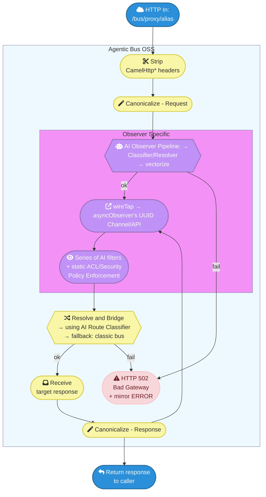
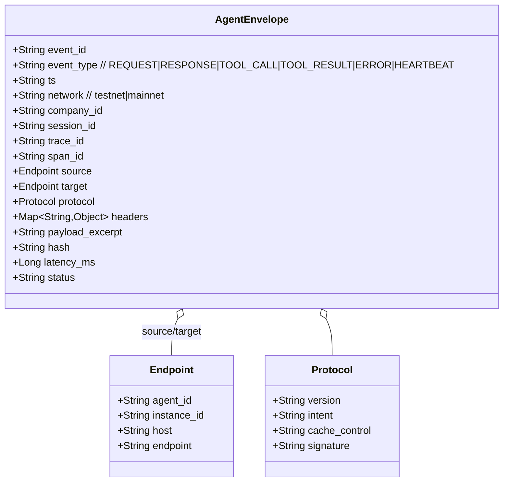
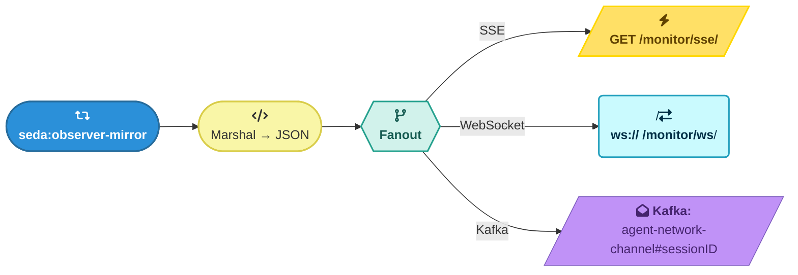
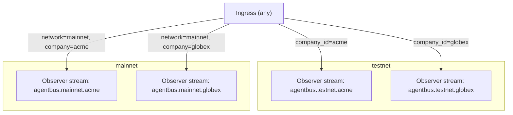
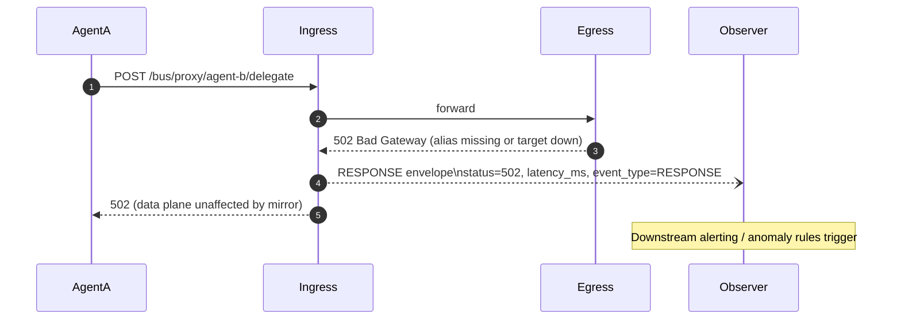

# Observer Cloud for Agentic Analytics
Create and Observability fabric/mesh network - a single network for Agentic and Non-Agentic Observability.

**Components**: 
- Runtime: AI native observability runtime that resolves paths, observables, vectorization, wire-tap etc.
- Observability Plane: set up subscribers to analyze and potentially act on the observables by notification, delegation of error fix to a bot, human-in-the-loop and more
- Dynamic Dashboard using Promptable UI (open source)

## System Dataflow (With Bus)

---

# Sequence — Base Case (No Bus)

---

# Sequence — With Bus (Transparent Proxy + Observer Mirroring)

---

# Flow/Logic — Ingress/Egress Route (Java/Camel Logic)

---

# Data Model — Canonical Envelope (for Observability)

---

# Flow/Logic — Observer Plane Fanout

---

# Dataflow — Partitioning & Multi-Network

---

# Sequence — Error/Anomaly Path (Non-Blocking)

---
### License Details

* Provider: Cascade Agentic Platform
* version: 0.0.1-beta
* License: Apache 2.0
